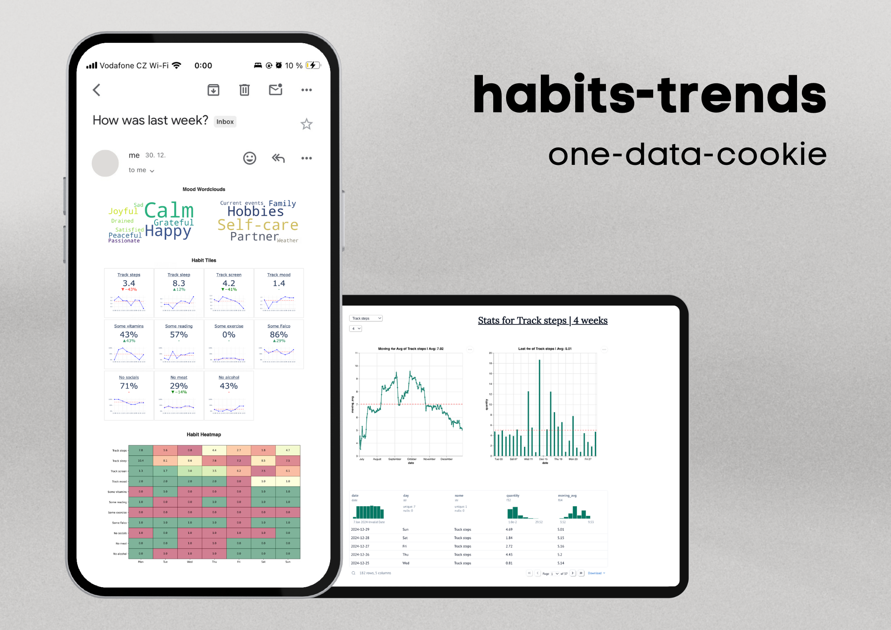

# habits-tracker

I've been using [Awesome Habits](https://www.awesome-habits.com/) for tracking my habits
but its analytics capabilities are not enough for my data-focused mind.
As a result, I built these small Python scripts using [marimo](https://marimo.io/)
that provide me both with an [interactive dashboard](app.py) and
[automated weekly email reports](alert.py).

This is how it looks 👇



If you wish to use it yourself, you can download your CSV file from the app,
configure your environment variables, and then run it using [`uv`](https://github.com/astral-sh/uv):

```bash
uv sync
uv run marimo run app.py
uv run marimo run alert.py
```

Note that the code will need some tweaking as its specifically designed to fit my needs.
You will also need to find your own way to automate CSV file sharing
(e.g. via [Apple Shortcuts](https://support.apple.com/en-gb/guide/shortcuts/welcome/ios))
and scheduling
(e.g. via [`launchd`](https://support.apple.com/en-gb/guide/terminal/apdc6c1077b-5d5d-4d35-9c19-60f2397b2369/mac)).
